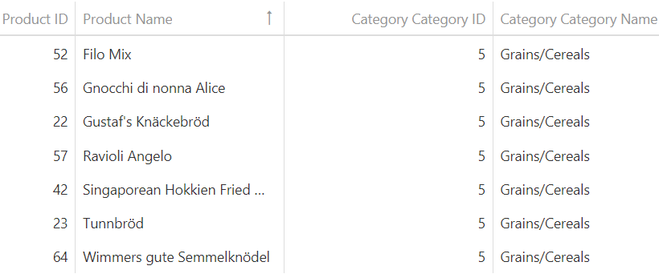

<!-- default badges list -->

[](https://supportcenter.devexpress.com/ticket/details/E4817)
[](https://docs.devexpress.com/GeneralInformation/403183)
<!-- default badges end -->

# ODataContext for DevExtreme - How to filter data by a foreign key value

<p>This example demonstrates how to select all products that are associated with a required category. The Product entity has the Category navigation property. To filter products by the category ID, we need to expand the Category property using the ODataStore.expand option. In this case, we will be able to access a key field of a navigation property. This example operates with the <a href="http://services.odata.org/Northwind/Northwind.svc/"><u>Northwind</u></a> online OData service. We can determine that Category is a navigation property of the Product one by typing the following URL in our browser "<a href="https://services.odata.org/Northwind/Northwind.svc/$metadata">https://services.odata.org/Northwind/Northwind.svc/$metadata</a>".</p>

<div align="center"></div>

## Implementation Details

```js
var db = new DevExpress.data.ODataContext({
        url: "<a href="https://services.odata.org/Northwind/Northwind.svc">http://services.odata.org/Northwind/Northwind.svc</a>",
        errorHandler: function (error) {
            alert(error.message);
        },
        entities: {
             Products: { key: "ProductID" }
        }
});

var viewModel = {
       dataSource: new DevExpress.data.DataSource({
            store: db.Products,
            select: ['ProductID', 'ProductName', 'Category.CategoryID', 'Category.CategoryName'],
            expand: ['Category'],
            filter: ['Category.CategoryID', '=', 5]
       })
};
```

## Files to Review

- **jQuery**
    - [index.html](jQuery/index.html)
    - [script.js](jQuery/script.js)

## Documentation

- [Getting Started with DataGrid](https://js.devexpress.com/Documentation/Guide/UI_Components/DataGrid/Getting_Started_with_DataGrid/)

- [DataGrid - API Reference](https://js.devexpress.com/Documentation/ApiReference/UI_Components/dxDataGrid/)

- [Using ODataContext](https://js.devexpress.com/Documentation/Guide/Data_Binding/Data_Source_Examples/#OData/Using_ODataContext)

